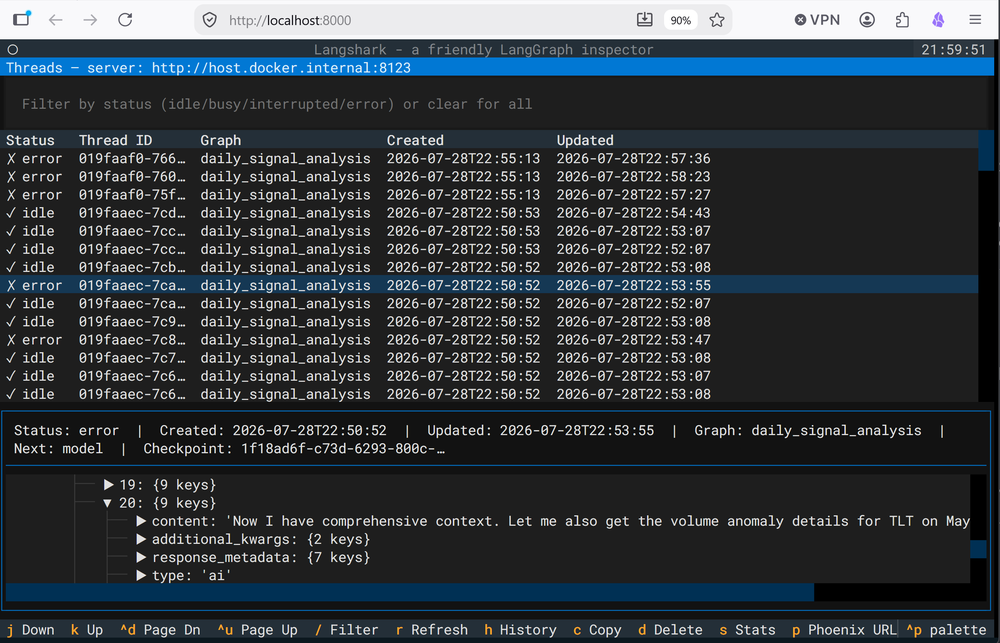
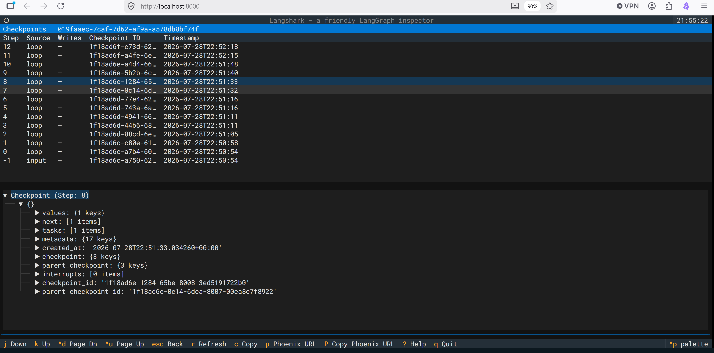

# Langshark

```
▓▓▓▓▓▓▓▓▓▓▓▓▓▓▓▓▓▓▓▓▓▓▓▓▓▓▓▓▓▓▓▓▓▓▓▓▓▓▓▓▓▓▓▓▓▓▓▓▓▓▓▓▓▓▓▓▓▓▓▓▓▓▓▓▓▓▓▓▓▓
▓▓▒▒▓▓▒▓░▒▒▓░▓▓▒▒░▓░▒▓▒░▓▒▓▓▒▒▒▓▓▒▓░▓░▓▓▓▓▒░▓▒▒▓▒▒▓▒▒▒▒▓▓░░▒░░▓▒▒▓░▓░▓
░▓░▓░▒░▓▓▓▒▒▓▓░▒▒▒▓░▓▓▓▒▓░▓▒▓▓▓▓░▓▓░▓▓▓▓▓▒▒▓▒▓░▒▓▒▒▒░▒▓▓▓▓▓▒░░▓░▒▒░░▓▒
▓▒▒▒░▓░▓▒▓▒▒▓▒▒▓▓░▒▓░░░░▓▒░▓▓░▓▓▓▓░▓▒░░▓▓██▓▓▓▓░▒▒▒▓▒▓▒▒▓▓▓▓▒▒▒▒▓▒░▓░▓
▒▓▓░▒▓▓░▓▒░▒░░▓░▒▒▓▓▓▓▓▒▓▒▓▓░▓▓░▒▓▓▓▒░░████▓▒▓▓▓░▓▒▒▓▒▓▒▓▒▒▒░▒▒▓▓▓░▒▓▒
▒▓░▓▒▒▓▒▓▓░▓▓▒▓░▓▒▓▒▓▓▒▓▓▓▓▓▓▓▓▓▓▓▓░▓▓██████▓▓▓▓▓▒▓▓▓▒▒▓▓▓▒░▒▒▓▓▓▓▓▒▓░
▓▒░▓▒▓▒░▓░▒▓░▒▓░░▒░▓▓░▓▓░▓▓░░▒▓▒▒▓░░█████████░▓▓░▒▓░▒░▒▓▓░▒░▓▒▓▓▓░▓▓▓▓
▓▒░░░▒▒░▓▒▓░▓▓▓▒▓▒▒▓▓▓░░▓░▒▒░░▓▒░▓▓░░▒▒▓▒▒▓▓▒░▒▓▒░░░▒░░▒░░▓▓▓▒▓▓░▒░▒▓▓
▓▓▓▓▓▓▓▓▓▓▓▓▓▓▓▓▓▓▓▓▓▓▓▓▓▓▓▓▓▓▓▓▓▓▓▓▓▓▓▓▓▓▓▓▓▓▓▓▓▓▓▓▓▓▓▓▓▓▓▓▓▓▓▓▓▓▓▓▓▓

                          L A N G S H A R K
               A friendly LangGraph inspector — v0.1.2
```

**Textual TUI for inspecting [LangGraph](https://docs.langchain.com/oss/python/langgraph/persistence) [threads](https://docs.langchain.com/oss/python/langgraph/persistence#threads) and [checkpoints](https://docs.langchain.com/oss/python/langgraph/checkpointers).**

## Features

- Connect to a running LangGraph server — a local
  [`langgraph dev`](https://docs.langchain.com/oss/python/langgraph/local-server)
  instance or a [self-hosted
  deployment](https://docs.langchain.com/langsmith/deploy-standalone-server)
- Browse [LangGraph threads](https://docs.langchain.com/oss/python/langgraph/persistence#threads), [checkpoint](https://docs.langchain.com/oss/python/langgraph/checkpointers) history and LLM calls.
- Inspect individual checkpoint state/values
- One-key copy (`c`) of any thread or checkpoint as formatted JSON
- Server stats screen (`s`) — connection info, queue depth, and worker
  pool metrics at a glance
- Optional [Arize Phoenix](https://arizeai.github.io/phoenix) deep-linking —
  Phoenix is an open-source AI observability platform that traces your
  LangGraph app's LLM calls, tool calls, latency, and token usage. With
  OpenInference instrumentation enabled, press `p` on any thread or
  checkpoint to get a deep link straight to the matching Phoenix trace.
- Keyboard-driven navigation


## How it looks

The screen splits horizontally: the **top pane** lists threads (or
checkpoints) in a navigable table, and the **bottom pane** shows the
selected item's state as an expandable JSON tree. Press `enter` to open or
toggle the detail pane, and `j`/`k` to move through the list. `escape`
closes the detail pane (threads) or goes back to the thread list
(checkpoints).



<details><summary>ASCII fallback</summary>

```
┌ Threads ──────────────────────────────────────────────────────┐
│ ✓ 3fa8b2c1…  idle         2026-07-29 10:30:00                 │
│ ⟳ 7b2d9e44…  busy         2026-07-29 10:29:45                 │
│ ⚠ a1c5f7b2…  interrupted  2026-07-29 10:28:12                 │
├ Thread 3fa8b2c1… ─────────────────────────────────────────────┤
│ values                                                        │
│ ├─ messages: [3 items]                                        │
│ │  ├─ [0] HumanMessage: "hi! I'm bob"                         │
│ │  ╰─ ...                                                     │
│ ├─ next: []                                                   │
│ ╰─ metadata: {step: 4, source: "loop"}                        │
└───────────────────────────────────────────────────────────────┘
```

</details>



<details><summary>ASCII fallback</summary>

```
┌ Checkpoints — 3fa8b2c1… ──────────────────────────────────────┐
│ 1f029ca3…  step 4   2026-07-29 10:30:00  (latest)             │
│ 1f029a17…  step 3   2026-07-29 10:29:58                       │
│ 1f029812…  step 2   2026-07-29 10:29:45                       │
├ Checkpoint 1f029ca3… ─────────────────────────────────────────┤
│ values                                                        │
│ ├─ channel_values: {messages: [...], foo: "b"}                │
│ ├─ channel_versions: {...}                                    │
│ ╰─ versions_seen: {...}                                       │
└───────────────────────────────────────────────────────────────┘
```

</details>

Other screens:

- **Server stats** — connection info, queue depth, and worker pool metrics
  ([screenshot](docs/server-stats.png))
- **Phoenix URL modal** — copy a Phoenix deep link for the selected trace
  ([screenshot](docs/langshark-phoenix-url.png))
- **Copy/paste modal** — clipboard helper for detail values
  ([screenshot](docs/thread-copy-paste.png))

### LLM-assisted debugging

Press `c` on any thread or checkpoint to copy its full state as formatted
JSON, then paste it into an LLM chat session for analysis. The analysis gets dramatically better when your LLM client has the two
LangChain documentation MCP servers configured:

- **LangChain Docs MCP** — narrative documentation (guides, concepts,
  how-tos) from [docs.langchain.com](https://docs.langchain.com)
- **LangChain API Reference MCP** — symbol-level API docs (classes,
  functions, signatures) from
  [reference.langchain.com](https://reference.langchain.com)


## Installation

```bash
# Install with uv
uv tool install langshark --from git+https://github.com/stokomax/langshark

# Or from source
git clone <repo-url>
cd langshark
uv sync
```

## Usage

### Built from source
```bash
# Connect to a LangGraph dev server. Default port is 2024.
langshark --connect http://127.0.0.1:2024

# With optional filters
langshark -c http://127.0.0.1:2024 --graph supervisor --status idle

# Phoenix trace deep-linking (requires OpenInference instrumentation)
langshark -c http://127.0.0.1:2024 --phoenix http://localhost:6006

# Connect to a LangGraph self-hosted server. Default port is 8123.
langshark --connect http://127.0.0.1:8123
```

> Note: Local JSONL trace file viewing is a future feature and is not yet
> available from the CLI.

### Docker (Recommended)

The image is hosted on GitHub Container Registry
([package page](https://github.com/stokomax/langshark/pkgs/container/langshark)).

```bash
# Pull the latest image
docker pull ghcr.io/stokomax/langshark:latest

# Show langshark CLI help
docker run --rm ghcr.io/stokomax/langshark --help

# TUI mode (interactive terminal) connecting to a self-hosted Langgraph server. Default port is 8123.
docker run -it --rm --add-host host.docker.internal:host-gateway \
  ghcr.io/stokomax/langshark -c http://host.docker.internal:8123

# Web UI mode (browser) — then open http://localhost:8000
docker run -it --rm -p 8000:8000 \
  --add-host host.docker.internal:host-gateway \
  ghcr.io/stokomax/langshark web "-c http://host.docker.internal:8123"

# Web UI on a custom host port (e.g. 8000 is already in use)
docker run -it --rm -p 8001:8000 \
  -e PUBLIC_URL=http://localhost:8001 \
  --add-host host.docker.internal:host-gateway \
  ghcr.io/stokomax/langshark web "-c http://host.docker.internal:8123"
# Then open http://localhost:8001
```

> Note: Change the port number from 8123 to 2024 if connecting to a langgraph dev server.  

> Note: `--rm` removes the container when you quit. `-it` allocates a TTY
> (required for the TUI). `--add-host host.docker.internal:host-gateway` lets
> the container reach a LangGraph server running on the host (required on
> Linux/WSL2 where `host.docker.internal` does not resolve by default).
>
> For the web UI, `PUBLIC_URL` must match the address you type into the
> browser — the served page builds its websocket URL from it. It defaults
> to `http://localhost:8000`.


### Docker aliases (copy-paste into your shell config)

**Bash / Zsh** (Linux, macOS, WSL — add to `~/.bashrc` or `~/.zshrc`):
```bash
alias langshark-tui='docker run -it --rm --add-host host.docker.internal:host-gateway ghcr.io/stokomax/langshark'
alias langshark-web='docker run -it --rm -p 8000:8000 --add-host host.docker.internal:host-gateway ghcr.io/stokomax/langshark web'
alias langshark-web-alt='docker run -it --rm -p 8001:8000 -e PUBLIC_URL=http://localhost:8001 --add-host host.docker.internal:host-gateway ghcr.io/stokomax/langshark web'
```

**PowerShell** (add to `$PROFILE`):
```powershell
function langshark-tui { docker run -it --rm ghcr.io/stokomax/langshark @args }
function langshark-web { docker run -it --rm -p 8000:8000 ghcr.io/stokomax/langshark web @args }
function langshark-web-alt { docker run -it --rm -p 8001:8000 -e PUBLIC_URL=http://localhost:8001 ghcr.io/stokomax/langshark web @args }
```

**CMD** (paste into a terminal session or `.bat` file):
```cmd
doskey langshark-tui=docker run -it --rm ghcr.io/stokomax/langshark $*
doskey langshark-web=docker run -it --rm -p 8000:8000 ghcr.io/stokomax/langshark web $*
doskey langshark-web-alt=docker run -it --rm -p 8001:8000 -e PUBLIC_URL=http://localhost:8001 ghcr.io/stokomax/langshark web $*
```

Usage (same across all shells):
```bash
langshark-tui -c http://host.docker.internal:8123
langshark-web "-c http://host.docker.internal:8123"        # open http://localhost:8000
langshark-web-alt "-c http://host.docker.internal:8123"    # open http://localhost:8001
```

> Note: The Bash/Zsh aliases include `--add-host host.docker.internal:host-gateway`
> because `host.docker.internal` does not resolve automatically on Linux/WSL2.
> PowerShell and CMD omit it — Docker Desktop for Windows provides the
> resolution automatically.

## Development

```bash
uv sync              # Install dependencies
uv run langshark     # Launch the TUI
uv run pytest        # Run tests
uv run ruff check    # Lint
```

For Textual debugging, launch textual console in a seperate terminal window. Then
launch langshark as shown below:
```
# textual run (default connection)
uv run textual run --dev langshark

# textual run with langshark options
uv run textual run --dev langshark.__main__:app -c http://localhost:8123 --graph supervisor
```

The textual serve launching is built into docker-entrypoint.sh.

To build the Docker image from source:
```
docker build -t langshark .
```
## License

MIT
